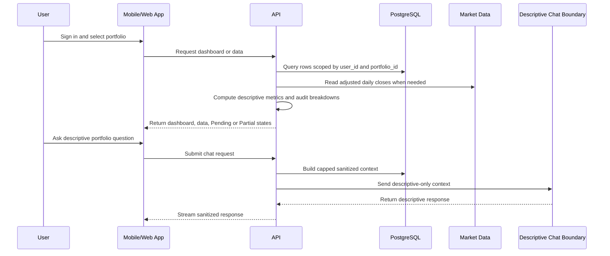

# Data Flow

Portfolio Tracker imports source records, normalizes them by user and portfolio, computes descriptive metrics, and presents auditable results.

## Source Inputs

- Statements
- Trade confirmations
- Normalized transaction rows
- Statement snapshots
- Adjusted daily market close rows

## Output Semantics

- Important metrics include auditable breakdowns.
- Missing source data does not silently fall back to unrelated periods.
- Missing market data appears as `Pending`.
- Partial source coverage appears as `Partial` when applicable.

## Data Minimization

The system stores and exposes only what is needed to support portfolio tracking and auditability. Public docs do not include real user data, full account numbers, or sensitive identifiers.
