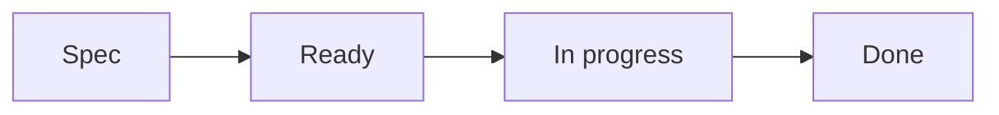

# Framework Workflow

Portfolio Tracker follows an AI-Driven Development workflow with local Spec Kit files and GitHub Work Item issue references.

## Work Item Gate

Substantial code or documentation changes require:

- One local Work Item in `portfolio-architect/specs/*/tasks.md`
- One GitHub Work Item issue reference for PR traceability
- A scoped branch named `codex/NNN-MMM-short-slug`
- One primary Work Item per PR
- Validation evidence
- Changelog and memory updates when applicable

## Status Flow

Local `tasks.md` and `tasks.es.md` files are the execution state source. Before a PR is opened, the completed local Work Item is marked `Done` in the final commit. GitHub issue labels, Project fields, comments, and open/closed state are not synchronized for routine status transitions.

## Portfolio Lifecycle Skills

The central Skills catalog lives in `portfolio-architect/codex/skills`.

| Lifecycle step | Skill |
|----------------|-------|
| Environment validation | `portfolio-validate-environment` |
| Ecosystem scaffolding | `portfolio-scaffold-ecosystem` |
| Infrastructure setup | `portfolio-setup-infrastructure` |
| API initialization or architecture alignment | `portfolio-init-api` |
| Requirement analysis | `portfolio-analyze-requirement` |
| Planning and decomposition | `portfolio-plan-and-decompose` |
| Work Item tracking | `portfolio-track-work-item` |
| Compliance validation | `portfolio-validate-compliance` |
| Documentation updates | `portfolio-update-docs` |
| Release/versioning | `portfolio-release-version` |

Repo entrypoints point agents back to this catalog for repeatable workflow execution.
