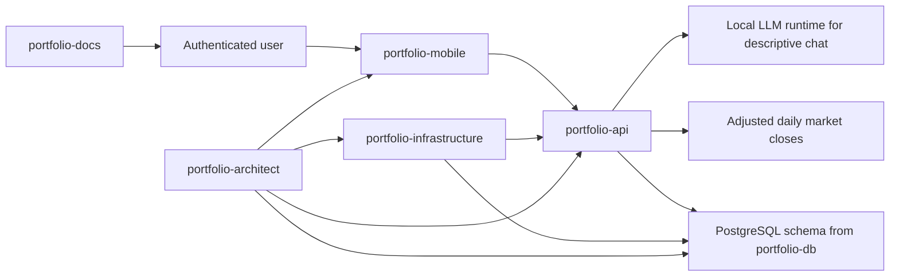

# System Overview

Portfolio Tracker is organized as a multi-repo ecosystem. The API owns product behavior and data access, the mobile app owns user-facing screens, the database repo owns schema assets, the infrastructure repo owns local orchestration, and the architecture repo owns governance memory.

## Core Principles

- Read-only product behavior.
- Descriptive insights only.
- Auditable metric breakdowns.
- User-owned data always scoped by `user_id` and `portfolio_id`.
- No full account numbers in UI, API responses, logs, public docs, or prompts.
- Missing source data or market data results in explicit `Pending`/`Partial` status.

## Current Implementation Summary

- The API uses Node.js, Express, TypeScript, Prisma, PostgreSQL, and Zod.
- The mobile app uses Expo, React Native, Expo Router, TypeScript, and TanStack Query.
- The database uses PostgreSQL SQL migrations and PowerShell operational scripts.
- Local infrastructure uses Docker Compose and PowerShell scripts.
- Project governance uses Markdown, ADRs, local Spec Kit Work Items, GitHub issue references, and a version manifest.
