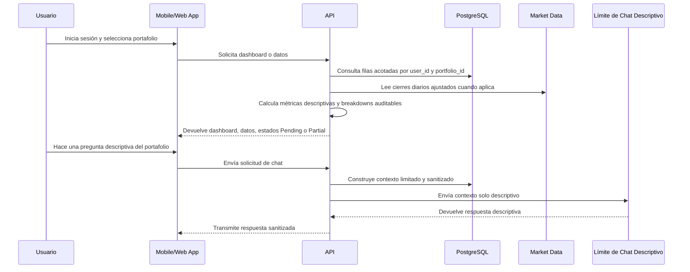

# Flujo De Datos

Portfolio Tracker importa registros fuente, los normaliza por usuario y portafolio, calcula métricas descriptivas y presenta resultados auditables.

## Entradas Fuente

- Statements
- Trade confirmations
- Filas de transacciones normalizadas
- Statement snapshots
- Filas de cierre diario ajustado de mercado

## Semántica De Salida

- Las métricas importantes incluyen breakdowns auditables.
- Los datos fuente faltantes no caen silenciosamente a periodos no relacionados.
- La market data faltante aparece como `Pending`.
- La cobertura parcial de fuentes aparece como `Partial` cuando aplica.

## Minimización De Datos

El sistema almacena y expone solo lo necesario para soportar tracking de portafolios y auditabilidad. Los docs públicos no incluyen datos reales de usuarios, números de cuenta completos ni identificadores sensibles.
