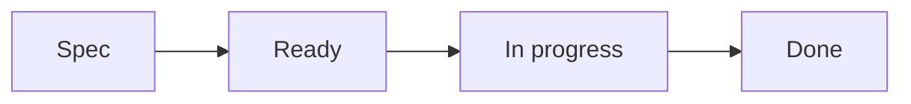

# Workflow Del Framework

Portfolio Tracker sigue un workflow AI-Driven Development con archivos locales Spec Kit y referencias GitHub Work Item issue.

## Gate De Work Item

Cambios sustanciales de código o documentación requieren:

- Un Work Item local en `portfolio-architect/specs/*/tasks.md`
- Una referencia GitHub Work Item issue para trazabilidad PR
- Una rama scoped llamada `codex/NNN-MMM-short-slug`
- Un Work Item primario por PR
- Evidencia de validación
- Changelog y actualizaciones de memoria cuando aplique

## Flujo De Estado

Los archivos locales `tasks.md` y `tasks.es.md` son la fuente del estado de ejecución. Antes de abrir un PR, el Work Item local completado se marca `Done` en el commit final. Labels, Project fields, comentarios y estado open/closed de GitHub issues no se sincronizan para transiciones rutinarias de estado.

## Portfolio Lifecycle Skills

El catálogo central de Skills vive en `portfolio-architect/codex/skills`.

| Paso de lifecycle | Skill |
|-------------------|-------|
| Validación de ambiente | `portfolio-validate-environment` |
| Scaffolding de ecosistema | `portfolio-scaffold-ecosystem` |
| Setup de infraestructura | `portfolio-setup-infrastructure` |
| Inicialización API o alineación de arquitectura | `portfolio-init-api` |
| Análisis de requisitos | `portfolio-analyze-requirement` |
| Planificación y descomposición | `portfolio-plan-and-decompose` |
| Tracking de Work Item | `portfolio-track-work-item` |
| Validación de compliance | `portfolio-validate-compliance` |
| Actualizaciones de documentación | `portfolio-update-docs` |
| Release/versioning | `portfolio-release-version` |

Los entrypoints de repo apuntan a este catálogo para ejecución repetible del workflow.
