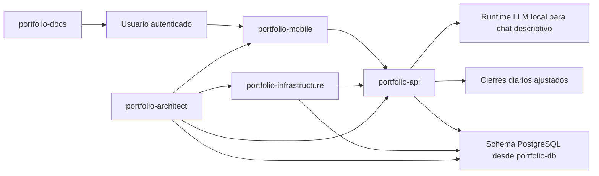

# Resumen Del Sistema

Portfolio Tracker está organizado como un ecosistema multi-repo. La API posee el comportamiento de producto y acceso a datos, la app mobile posee las pantallas de usuario, el repo database posee assets de schema, el repo infrastructure posee la orquestación local y el repo architecture posee memoria de gobernanza.

## Principios Centrales

- Comportamiento de producto read-only.
- Insights solo descriptivos.
- Breakdowns de métricas auditables.
- Datos del usuario siempre acotados por `user_id` y `portfolio_id`.
- Sin números de cuenta completos en UI, respuestas API, logs, docs públicos ni prompts.
- Datos fuente o market data faltante resultan en estados explícitos `Pending`/`Partial`.

## Resumen De Implementación Actual

- La API usa Node.js, Express, TypeScript, Prisma, PostgreSQL y Zod.
- La app mobile usa Expo, React Native, Expo Router, TypeScript y TanStack Query.
- La base de datos usa migraciones SQL PostgreSQL y scripts operativos PowerShell.
- La infraestructura local usa Docker Compose y scripts PowerShell.
- La gobernanza del proyecto usa Markdown, ADRs, Spec Kit Work Items, referencias GitHub issue y un version manifest.
